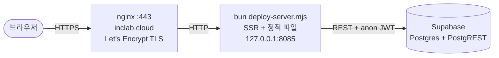
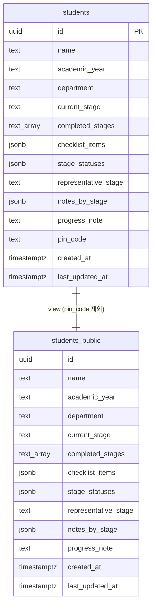
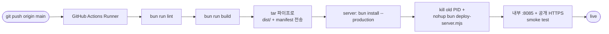

# lab-progress-pal

> INC Lab 학부연구생의 학습 진행 상황을 공유하는 보드 — **https://inclab.cloud**

학생별 학습 단계(S1~S6), 단계별 체크리스트, 진행률을 한 화면에서 확인하고 본인 PIN으로 직접 갱신할 수 있는 미니 트래커입니다.

---

## 주요 기능

- **단계 보드**: S1 Python 기초부터 S6 SCIE 논문 제출까지 9단계의 진행 상황을 한눈에
- **체크리스트 기반 진행률**: 단계별 상태 + 체크리스트 완료율을 가중 평균해 자동 계산
- **PIN 기반 셀프 편집**: 본인이 등록한 4자리 PIN으로만 본인 항목 수정 가능
- **인터랙티브 가이드**: 첫 방문 시 5단계 코치마크 투어 + 필드별 도움말 팝오버
- **반응형**: 데스크탑(테이블) / 모바일(카드) 자동 전환

---

## 기술 스택

| 영역          | 도구                                                                |
| ------------- | ------------------------------------------------------------------- |
| 프레임워크    | [TanStack Start](https://tanstack.com/start) (React 19 + SSR)       |
| 라우팅        | TanStack Router (file-based)                                        |
| 데이터 페칭   | TanStack React Query                                                |
| 백엔드        | [Supabase](https://supabase.com) (Postgres + PostgREST + RLS)       |
| UI            | [shadcn/ui](https://ui.shadcn.com) + Tailwind CSS v4 + lucide-react |
| 폼 / 검증     | react-hook-form + Zod                                               |
| 온보딩        | driver.js                                                           |
| 빌드 / 런타임 | Vite 7 + Bun 1.3 + Node 24                                          |
| 배포          | AWS Lightsail (Ubuntu) + nginx + Let's Encrypt                      |
| CI/CD         | GitHub Actions                                                      |

---

## 시스템 구조



프론트엔드는 SSR 후 클라이언트 하이드레이션, 데이터는 Supabase REST를 통해 직접 호출합니다. 별도 백엔드 API 서버는 없으며 권한 통제는 Supabase RLS와 컬럼 단위 GRANT로 처리됩니다.

---

## 데이터 모델

단일 테이블 구조입니다. 보안 노출 표면을 줄이기 위해 `pin_code`가 제외된 공개 뷰를 별도로 둡니다.



### 주요 컬럼

| 컬럼                            | 타입        | 설명                                                                            |
| ------------------------------- | ----------- | ------------------------------------------------------------------------------- |
| `id`                            | uuid        | 학생 고유 ID (PK)                                                               |
| `name`                          | text        | 이름                                                                            |
| `academic_year`                 | text        | 학년도 (예: "2026")                                                             |
| `department`                    | text        | 학과 (선택)                                                                     |
| `representative_stage`          | text        | 카드에 표시될 대표 단계 키 (`"1"`–`"6"`)                                        |
| `stage_statuses`                | jsonb       | 단계별 상태 — `{"1": "미시작", "1.5": "달성", ...}`                             |
| `checklist_items`               | jsonb       | 단계별 체크 항목 — `{"1": {"py_vars": true, ...}, ...}`                         |
| `notes_by_stage`                | jsonb       | 단계별 메모                                                                     |
| `progress_note`                 | text        | 전체 학습 메모                                                                  |
| `pin_code`                      | text        | 수정/삭제 시 사용하는 4자리 비밀번호 (해시 없이 평문 저장 — **개선 여지 있음**) |
| `created_at`, `last_updated_at` | timestamptz | 생성/수정 시각                                                                  |

### 접근 권한

- **anon / authenticated** 역할: `students_public` 뷰만 SELECT 가능 (`pin_code` 노출 불가)
- 학생 수정/삭제는 SSR 측 서버 함수가 `pin_code` 검증 후 service role 키로 처리
- 자세한 RLS와 GRANT 정책은 [supabase/migrations/](supabase/migrations/) 참조

---

## 학습 단계 (Stage) 시스템

| Stage | 제목                | 핵심 기준                                           |
| ----- | ------------------- | --------------------------------------------------- |
| S1    | Python 기초         | Python 기본 문법 + 150줄 이내 프로그램 작성         |
| S1.5  | C 언어              | 함수, 배열, 구조체, 포인터, call by value/reference |
| S2    | 외부 기기 실행      | Raspberry Pi 등에서 C/Python 프로그램 실행          |
| S2.5  | 비 Windows OS       | Linux / Raspbian 설치 및 활용                       |
| S3    | 자료구조와 알고리즘 | 스택/큐/트리, 정렬/탐색, 재귀/DP 기초               |
| S3.5  | 알고리즘 문제 풀이  | 100문제 이상 풀이 경험                              |
| S4    | 국내 학회 발표      | 2페이지 논문 작성 + 포스터 발표                     |
| S5    | 국제 학회 발표      | 영문 논문 + 국제 학회 발표                          |
| S6    | SCIE 논문 제출      | SCIE 저널 풀논문 작성 + 제출                        |

각 단계는 **순서와 무관**하게 독립적으로 기록할 수 있습니다 (대표 단계는 카드에 노출될 단계 선택).

### 단계 상태 (4가지)

| 상태      | 가중치 |
| --------- | ------ |
| 미시작    | 0 %    |
| 진행 중   | 25 %   |
| 부분 달성 | 60 %   |
| 달성      | 100 %  |

### 진행률 계산

```
한 단계의 진행률 = 상태 가중치 × 0.7 + 체크리스트 완료율 × 0.3
전체 진행률      = 모든 단계 진행률의 평균
```

소스: [src/lib/stages.ts](src/lib/stages.ts) — `overallProgress`, `STATUS_WEIGHT`

---

## 로컬 개발 환경 셋업

### 사전 요구사항

- **Node 24+**
- **Bun 1.3+** ([설치](https://bun.sh))
- Supabase 프로젝트에 대한 publishable key (`.env`에 기재)

### 1. 의존성 설치

```bash
bun install
```

### 2. 환경변수 설정

저장소 루트에 `.env` 파일을 만들고 다음 키를 채웁니다 (값은 운영자에게 문의):

```env
SUPABASE_URL=https://<project-ref>.supabase.co
SUPABASE_PUBLISHABLE_KEY=sb_publishable_...
SUPABASE_SERVICE_ROLE_KEY=sb_secret_...
VITE_SUPABASE_PROJECT_ID=<project-ref>
VITE_SUPABASE_URL=https://<project-ref>.supabase.co
VITE_SUPABASE_PUBLISHABLE_KEY=sb_publishable_...
```

- `VITE_*` 접두사는 클라이언트 번들에 주입 (브라우저에서 보여도 안전한 키만)
- `SUPABASE_SERVICE_ROLE_KEY`는 서버 함수에서만 사용 (절대 클라이언트 노출 금지)
- `.env`는 `.gitignore`에 포함됨

### 3. 개발 서버 실행

```bash
bun run dev
```

→ http://localhost:5173

### 사용 가능한 스크립트

| 스크립트          | 용도                                         |
| ----------------- | -------------------------------------------- |
| `bun run dev`     | Vite 개발 서버 (HMR)                         |
| `bun run build`   | 프로덕션 빌드 (`dist/client`, `dist/server`) |
| `bun run preview` | 빌드 결과물 로컬 프리뷰                      |
| `bun run lint`    | ESLint + prettier 검사 (CI 게이트)           |
| `bun run format`  | prettier 일괄 적용                           |

---

## 디렉토리 구조

```
.
├── .github/workflows/deploy.yml   # CI/CD (push → 자동 배포)
├── deploy-server.mjs              # 프로덕션 Node HTTP 서버 (port 8085)
├── src/
│   ├── routes/                    # TanStack Router (파일 기반)
│   │   ├── __root.tsx             # 공통 헤더/레이아웃
│   │   ├── index.tsx              # 대시보드 (/)
│   │   └── students.$id.tsx       # 학생 상세 (/students/:id)
│   ├── components/                # UI 컴포넌트
│   │   ├── ui/                    # shadcn 프리미티브
│   │   ├── OnboardingBanner.tsx   # 첫 방문 안내 배너
│   │   ├── OnboardingTour.tsx     # driver.js 5단계 투어
│   │   ├── HelpPopover.tsx        # 필드별 도움말 ? 버튼
│   │   ├── AddStudentModal.tsx    # 학생 등록
│   │   ├── EditStudentModal.tsx   # 학생 수정 (3탭)
│   │   ├── PinModal.tsx           # PIN 확인
│   │   └── ...
│   ├── lib/
│   │   ├── stages.ts              # 단계 정의 + 진행률 계산
│   │   ├── schemas.ts             # Zod 폼 스키마
│   │   ├── students-client.ts     # 클라이언트 데이터 액세스
│   │   └── students.functions.ts  # 서버 함수 (mutations)
│   ├── hooks/
│   │   ├── use-mobile.ts          # 모바일 뷰포트 감지
│   │   └── use-onboarding.ts      # 온보딩 상태 (localStorage)
│   ├── integrations/supabase/
│   │   ├── client.ts              # 싱글톤 클라이언트
│   │   └── types.ts               # supabase gen types로 자동 생성
│   ├── server.ts                  # SSR 엔트리
│   └── start.ts                   # TanStack Start 미들웨어
├── supabase/
│   ├── migrations/                # SQL 마이그레이션 (timestamp prefix)
│   └── config.toml                # project_id
└── package.json
```

---

## 데이터베이스 마이그레이션

스키마 변경은 항상 새 SQL 파일로 기록합니다 (기존 파일 수정 금지).

### 새 마이그레이션 만들기

```bash
# 1. UTC 타임스탬프 생성
date -u +%Y%m%d%H%M%S
# → 20260524093353

# 2. 파일 생성
# supabase/migrations/20260524093353_<설명_slug>.sql
```

### 컨벤션

- 멱등성 우선 (`CREATE TABLE IF NOT EXISTS`, `ADD COLUMN IF NOT EXISTS`)
- 권한 변경은 REVOKE 후 GRANT 패턴 ([`20260523063401_tighten_public_student_privileges.sql`](supabase/migrations/20260523063401_tighten_public_student_privileges.sql) 참고)
- 컬럼 추가 후 [src/integrations/supabase/types.ts](src/integrations/supabase/types.ts) 재생성:
  ```bash
  npx supabase gen types typescript --project-id <project-ref> > src/integrations/supabase/types.ts
  ```

### 원격에 적용

운영자 권한 필요:

```bash
# Supabase CLI 인증 후
npx supabase db push
```

또는 Supabase Studio SQL Editor에서 직접 실행. push 후 GitHub의 `Supabase Preview` check가 자동으로 동기화 확인.

---

## 배포

### 흐름



자세한 단계는 [.github/workflows/deploy.yml](.github/workflows/deploy.yml) 참조.

### 주요 특징

- 빌드는 GitHub 러너에서 (Lightsail 메모리 부담 회피)
- `dist/`, `deploy-server.mjs`, `package.json`, `bun.lock`만 전송 — `node_modules`는 서버에서 `bun install --production`
- `concurrency` 락으로 동시 deploy 방지
- 다운타임 약 2~3초 (PID kill → nohup 재시작)

### 필요한 GitHub Secrets

| Secret                          | 용도                                                   |
| ------------------------------- | ------------------------------------------------------ |
| `SSH_PRIVATE_KEY`               | EC2 접속용 SSH 개인키 (전체 내용, BEGIN/END 라인 포함) |
| `VITE_SUPABASE_URL`             | 빌드 시 클라이언트 번들에 주입                         |
| `VITE_SUPABASE_PUBLISHABLE_KEY` | 빌드 시 클라이언트 번들에 주입                         |

`Settings → Secrets and variables → Actions`에서 등록. 추가는 저장소 관리자만 가능.

### 수동 배포 (긴급 시)

GitHub Actions UI에서 `Deploy to inclab.cloud` 워크플로우 → **Run workflow**.

---

## 협업 가이드

### 브랜치 전략

- `main` 브랜치만 운영. push되면 즉시 배포되므로 직접 push보다는 **PR 권장**
- 기능별 브랜치명: `feat/<기능>`, `fix/<버그>`, `chore/<잡일>`

### 커밋 메시지

[Conventional Commits](https://www.conventionalcommits.org) 스타일:

```
feat(stages): add S5 international conference stage
fix(deploy): defer driver.js to client to avoid SSR ENOENT
chore: stop tracking AI dev tooling
```

스코프는 선택. 첫 줄은 50자 이내 권장.

### 코드 스타일

- Prettier + ESLint 자동 적용 — PR 전 `bun run lint` 한 번 확인
- TypeScript strict (`any` 지양)
- 컴포넌트는 named export, 페이지 라우트는 default 패턴
- 새 shadcn 컴포넌트가 필요하면 `npx shadcn add <name>`

### PR 체크리스트

- [ ] `bun run lint` 통과
- [ ] 새 의존성 추가 시 `package.json` + `bun.lock` 함께 commit
- [ ] DB 스키마 변경 시 마이그레이션 파일 포함 + 본인이 원격 적용
- [ ] 환경변수 추가 시 README의 셋업 섹션 갱신
- [ ] UI 변경 시 모바일/다크모드 확인

### 코드 리뷰 자동화

저장소 협업자라면 Claude Code의 `code-reviewer` 에이전트를 활용할 수 있습니다. AI 도구 설정은 개인 환경별로 셋업 (이 저장소엔 포함 안 됨).

---

## 운영 메모

| 항목              | 위치                                                        |
| ----------------- | ----------------------------------------------------------- |
| 라이브 URL        | https://inclab.cloud                                        |
| 호스팅            | AWS Lightsail (Ubuntu 20.04)                                |
| nginx 사이트 설정 | `/etc/nginx/sites-enabled/lab-progress-pal`                 |
| TLS               | Let's Encrypt (Certbot 자동 갱신)                           |
| 앱 디렉토리       | `/home/ubuntu/lab-progress-pal/`                            |
| 프로세스          | `bun deploy-server.mjs` (PID는 `lab-progress-pal.pid`)      |
| 로그              | `~/lab-progress-pal/nohup.out`                              |
| Supabase 대시보드 | https://supabase.com/dashboard/project/ghptyqnpjppzhnnzzqxu |
